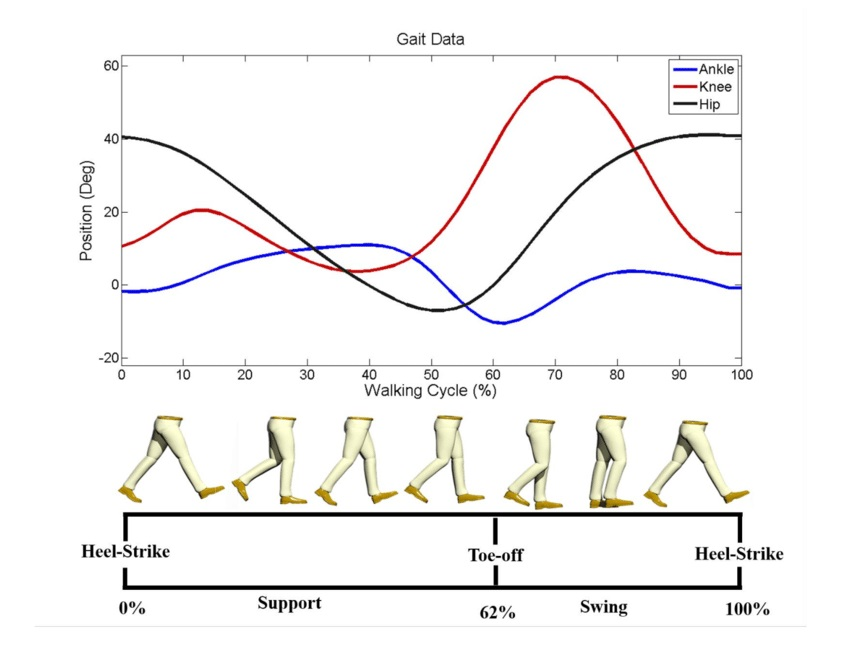
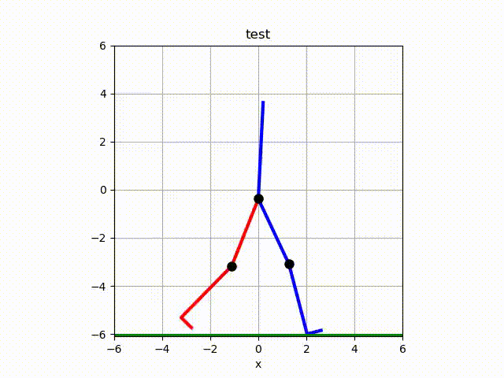

# Exoskeleton Simulation tool
The two XLSX files keep track of the angle that the hip and knee have during a normal gait cycle. 
They include 99 values from **1%** to **100%** of the cycle. The **.py** file reads this type of files and generates an
animation of a figure walking acording to the data in the files. 

## 
 My values were extracted with sampling from the diagramm of the picture.
  
  
## 
 The output animation is this.
  
